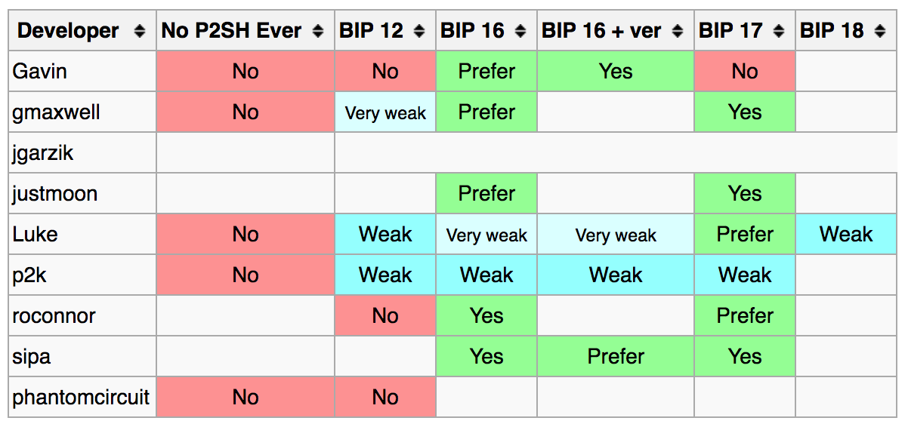

# On Bitcoin

I've been reading up on Bitcoin lately, my curiosity driven by fear of missing out. Concurrently, at work I've been thinking about software engineering, and the culture and process that enables it. These two themes, overlayed with each other, have left with some thoughts.

The questions I want to answer are,

1. Whether decentralised software development is slower compared to a bunch of engineers working together in a room?
2. How do ownerships and decision making work?
3. What can we learn from Bitcoin's software development process that can improve _centralised_ software development?

**Caveat emptor**: I'm no software engineering expert, only a critical observer of culture and process, especially as they impact my own and the team's productivity at work. As a team of less than a dozen engineers building a product gaining rapid traction, our culture and process are often tested, and often fail to deliver in the short-term.

* Forks
* CHECKMULTISIG
* BIP 16/17

Decentralised software engineering is only a narrow cut on looking at Bitcoin, and I hope to write more on other perspectives on it. One thing I want to analyse impact of the deflationary nature of Bitcoin, especially how that impacts the conversion rate against USD.
