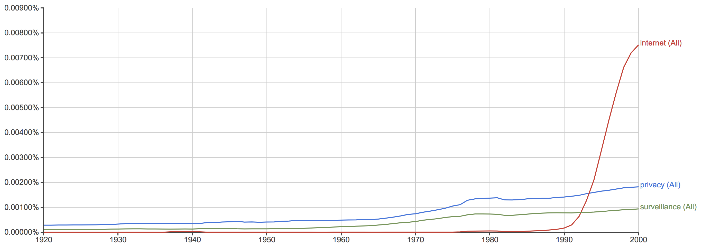

Tags: privacy, books, history

# War and privacy

I've wondered why Western attitude to privacy and surveillance is at odds with the Indian, and perhaps more generally, the oriental sentiment. There is a probably a plethora of big and small reasons, but I haven't heard a pithy, believable, and interesting solution—like the one you would expect to find in an Yuval Harari novel. I have a theory now, thanks to Cryptonomicon.

Without questioning why the Indian mind does not respect privacy and abhor surveillance, the idea is to explain why the western mind does, and vehemently so. This is while I'm sitting thousands of miles away, so I am expecting (hoping) to be corrected. My hypothesis is the Second World War. When a pivotal historical event depended heavily on intercepting and decrypting private messages, I think it is safe to assume that it left a cultural mark on the society.

Politically, the war's legacy included setting up the [NSA](https://en.wikipedia.org/wiki/National_Security_Agency) in 1952, which is described by a fictional IBM exec/army officer in the book as a post-war Bletchley Park operating at scale. The legacy also included classifying exported [cryptography as weapons](https://en.wikipedia.org/wiki/Export_of_cryptography_from_the_United_States), because of the negative impact that could have on public safety. While I don't have examples to substantiate the war's cultural legacy, there is a Google Ngram chart.

Couple of things that struck me:

1. The rise of terms privacy and surveillance happened post the 1960s (the slope changes suddenly around 1965)
2. The rise of the Internet did not really change the slope of the terms

Unlike what I would have incorrectly assumed from popular media, the rise of these terms pre-dates the Internet. The rise immediately follows the Second World War. One can argue that the slope changes 20 years after the war ends, which to me actually seems like a fair amount of time for society to start thinking/talking. Or perhaps it's a decade late and my theory is incorrect.

Theory inspiration aside, Cryptonomicon captures why I like Neal Stephenson: storylines that interlock into each other, and mix of fictional and historical characters. If only his works weren't this dense and 1000s of pages long, or I had as much time as I do these days, I would have actually finished the Baroque Cycle books. Here's hoping I will eventually finish them, before Stephenson releases a book about the blockchain.
